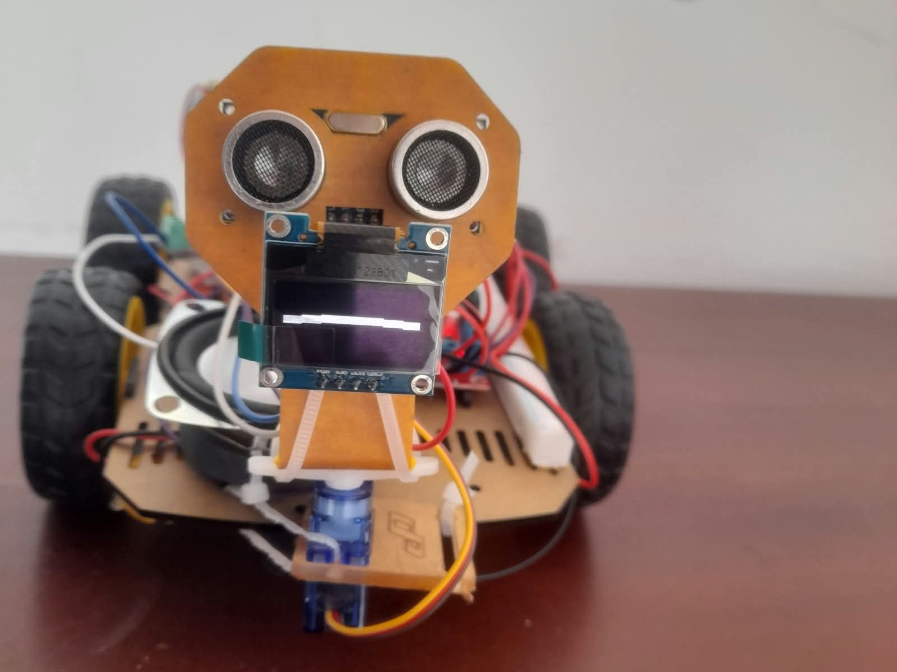
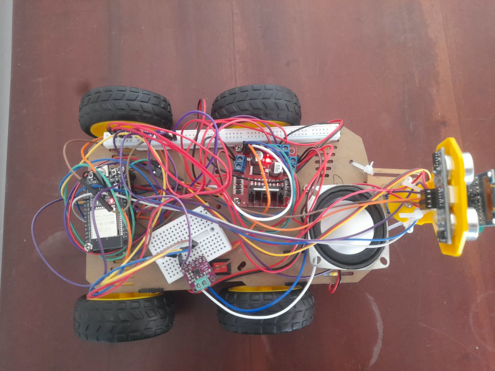

# ESP32 Obstacle Avoidance Robot Pet

An autonomous obstacle-avoidance robot built on an ESP32, with voice feedback and OLED facial expressions that react to its own decision-making in real time.

The robot drives forward continuously and uses an HC-SR04 ultrasonic sensor to watch the path ahead. When it detects an obstacle, it stops, reverses slightly, scans both sides with a servo-mounted sensor, compares the two distances, and turns toward whichever side is more open — reacting with a voice clip and a matching OLED expression at each stage.

## Demo
<p align="center">
   
  
</p>

## Features

- Autonomous obstacle detection and avoidance
- HC-SR04 ultrasonic distance sensing
- Servo-based left/right scanning with automatic direction selection
- Dual DC motor control via L298N
- Voice feedback through a MAX98357A I2S amplifier, with WAV clips stored in ESP32 LittleFS
- SSD1306 OLED expressions synced to the robot's current "reaction"
- Distinct behavior for obstacles, near-collisions, repeated obstacles, scanning, turning, and successful avoidance

## Hardware

| Component | Role |
|---|---|
| ESP32 | Main microcontroller |
| L298N | Dual DC motor driver |
| HC-SR04 | Ultrasonic distance sensor |
| SG90 | Servo motor for left/right scanning |
| DC motors (x2) | Robot drive wheels |
| MAX98357A | I2S audio amplifier |
| 3W 4Ω speaker | Voice output |
| SSD1306 OLED (128×64, I2C) | Facial expression display |

## Pin Configuration

### L298N Motor Driver

| L298N | ESP32 |
|---|---|
| ENA | GPIO14 |
| IN1 | GPIO26 |
| IN2 | GPIO27 |
| IN3 | GPIO25 |
| IN4 | GPIO33 |
| ENB | GPIO13 |

### HC-SR04 Ultrasonic Sensor

| HC-SR04 | ESP32 |
|---|---|
| TRIG | GPIO19 |
| ECHO | GPIO18 |

> The ECHO line is stepped down through a resistor voltage divider before reaching the ESP32, since the sensor outputs 5V and the GPIO pin is only rated for 3.3V.

### SG90 Servo

| Servo | ESP32 |
|---|---|
| Signal | GPIO23 |

### MAX98357A I2S Amplifier

| MAX98357A | ESP32 |
|---|---|
| BCLK | GPIO4 |
| LRC / LRCLK | GPIO32 |
| DIN | GPIO15 |

### SSD1306 OLED

| OLED | ESP32 |
|---|---|
| SDA | GPIO21 |
| SCL | GPIO22 |

## How It Works

1. Drive forward.
2. Measure the distance directly ahead.
3. If the path is clear, keep driving forward.
4. If an obstacle is detected:
   1. Stop, and react with a voice clip and OLED expression.
   2. Reverse a short distance.
   3. Rotate the sensor left and measure the distance.
   4. Rotate the sensor right and measure the distance.
5. Compare the left and right readings.
6. Turn toward whichever side is more open.
7. Re-check the path ahead.
8. Resume driving forward.

If both sides are still blocked after backing up, the robot performs a longer turn instead of a standard pivot.

## Voice Feedback

Short WAV clips are stored in the ESP32's LittleFS filesystem and played back through the MAX98357A depending on what the robot is currently doing:

| Clip | Trigger |
|---|---|
| `hello.wav` | Boot-up |
| `start.wav` | Right after boot, before driving begins |
| `clear.wav` | Path opens up after being blocked |
| `obstacle.wav` | First-time obstacle detection |
| `danger.wav` | Obstacle much closer than the usual threshold |
| `again.wav` | Another obstacle shortly after the last one |
| `scan.wav` | Servo scanning left or right |
| `left.wav` / `right.wav` | Direction chosen, right before turning |
| `turn.wav` | Played while the pivot itself is happening |
| `blocked.wav` | Both sides still blocked after backing up |
| `unexpected.wav` | Blocked again immediately after finishing a turn |
| `easy.wav` | Resuming driving after a simple, clean avoid |
| `yay.wav` | Resuming driving after escaping a both-sides-blocked situation |
| `idle.wav` | Periodic sound during long, uninterrupted clear driving |
| `bored.wav` | Extended clear driving with no obstacles at all |
| `greeting.wav`, `tired.wav`, `bye.wav` | Reserved for future use (e.g. wake command, low-battery warning, shutdown) |

## OLED Expressions

The OLED acts as the robot's mouth (the HC-SR04 doubles visually as its "eyes"), with distinct expressions for:

- **Idle** — relaxed, closed mouth
- **Surprised** — open "O", shown on obstacle detection
- **Looking left / looking right** — small pursed "thinking" mouth, shown while scanning
- **Happy** — wide smile, shown after successfully avoiding an obstacle

The display is mounted upside down on the chassis, so it's flipped 180° in software (`display.setRotation(2)`) rather than by re-wiring.

## Software

Built with:

- [Arduino IDE](https://www.arduino.cc/en/software)
- ESP32 board package (via Arduino Boards Manager)
- [ESP32Servo](https://github.com/madhephaestus/ESP32Servo) — reliable servo control on ESP32
- [Adafruit GFX Library](https://github.com/adafruit/Adafruit-GFX-Library)
- [Adafruit SSD1306](https://github.com/adafruit/Adafruit_SSD1306)
- [ESP8266Audio](https://github.com/earlephilhower/ESP8266Audio) — I2S + WAV playback (works on ESP32 despite the name)
- LittleFS (built into the ESP32 Arduino core)

## Installation

1. Install the Arduino IDE.
2. Add the ESP32 board package via Boards Manager.
3. Install the libraries listed above via Library Manager.
4. Open `obstacle_avoidance_robot.ino`.
5. Select your ESP32 board under **Tools → Board**.
6. Select the correct port under **Tools → Port**.
7. Select a partition scheme with LittleFS/SPIFFS space (e.g. "Default 4MB with spiffs") under **Tools → Partition Scheme**.
8. Upload the sketch as normal.
9. Upload the WAV files in `/data` to LittleFS using the **Arduino LittleFS Upload** tool — this is a separate step from the normal sketch upload.
10. Power the robot and test.

## Project Structure

```text
obstacle_avoidance_robot/
│
├── obstacle_avoidance_robot.ino     # Main sketch
├── README.md
│
├── data/                            # WAV voice clips (uploaded via LittleFS)
│   └── *.wav
│
└── docs/                            # Wiring diagrams, photos, extra notes
```

## Future Improvements

- Real-time voice command input via an I2S microphone (no phone/app required)
- Battery voltage monitoring to trigger the reserved `tired.wav` clip
- Non-blocking audio playback so the robot can "talk" while still moving

## License

This project is open source under the [MIT License](LICENSE).

## Author

**Naveena Rajendran**
Final-year Software Engineering undergraduate, University of Sri Jayewardenepura
[GitHub](https://github.com/Naveena-27) · [LinkedIn](https://linkedin.com/in/naveena-rajendran-833a19304)
